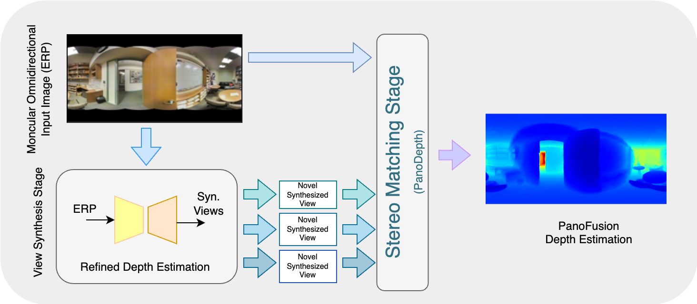

# PanoFusion : A Monocular Omnidirectional Depth Estimation 

**A Python package for depth estimation from monocular 360 image**


## Introduction

The **PanoFusion** model is inspired by two state-of-the-art works: the  [PanoDepth](https://yuyanli0831.github.io/PanoDepth-Website/) repository and [OmniFusion](https://github.com/yuyanli0831/OmniFusion) repository, both authored by created by [Yuyan Li](https://github.com/yuyanli0831). Building on these models, we developed PanoFusion, a model that estimates depth in 360-degree images in two stages. First, it makes a basic depth estimate using OmniFusion model at stage 1, hence getting enhanced synthesized views serving as refined input for the PanoDepth stage 2, the stereo matching phase. This leads to a much-improved final depth estimation. Compared to the original two models, PanoFusion shows better performance.


## Pipeline

<p align="center">

<br>
  <em> Figure 1. The 2-stage PanoFusion Framework. Stage 1: the pipeline accepts an ERP as input and synthesizes novel views (SV) based on the OmniFusion model for the next stage. Stage 2: the model takes the original ERP input image and the SV for the stereo-matching phase based on the Panodepth model. The result is a refined depth estimation. </em>
</p>


## Instructions

#### Prepare the environment:
```
cd <repo>

conda create -n omnifusion_pip python=3.7.4 
conda activate omnifusion_pip
pip3 install -r requirements.txt
conda install -c conda-forge openexr-python # yes
pip install mmcv==1.5.0
pip install mmsegmentation==0.23.0
```

#### Run:

```
cd <repo>

conda activate omnifusion_pip

python3 main_fullpipeline.py # fine-tuning

python3 evaluate_fullpipeline.py # use on test dataset

python3 evaluate_fullpipeline_mymg.py # use on random images
```

## Models:

Models are available [here](https://mbzuaiac-my.sharepoint.com/:f:/g/personal/dmitry_demidov_mbzuai_ac_ae/Ev2nvnWoDHpLoB0LKbIhN5sB4KY1JxN6cUo-BYYlJ4FvQw?e=8Akqmo).


## Other

```
cd '/l/users/20020067/Study/PhD/2 semester/CV-802 (3D vision)/Project/_Ours/PanoFusion/'

source /apps/local/anaconda2023/conda_init.sh
# (local):
conda activate omnifusion_pip
# (shared): 
conda activate /l/users/MODE/envs/omnifusion_pip

python ./OmniFusion/test.py --nrows 4
```

#### Create environment:

```
conda activate omnifusion_pip
pip3 install -r requirements.txt
#conda install -c conda-forge openexr # not rly?
conda install -c conda-forge openexr-python # yes
pip install mmcv==1.5.0
pip install mmsegmentation==0.23.0
```

#### copy environment to the shared folder:

```
conda create --prefix ./name --clone name
```


## Dataset

- We trained our method on Stanford2D3D. 
- We evaluate our model on Stanford2D3D and our own MBZUAI-MetaverseLab ERP images.


Notes:
- For Stanford2D3D: a standard pre-process of the original Matterport3D dataset is applied for the development of 360-image-based depth estimation.
- For MBZUAI-MetaverseLab: images were captured on the MetaverseLab environment, with an Insta360 X3 camera.
